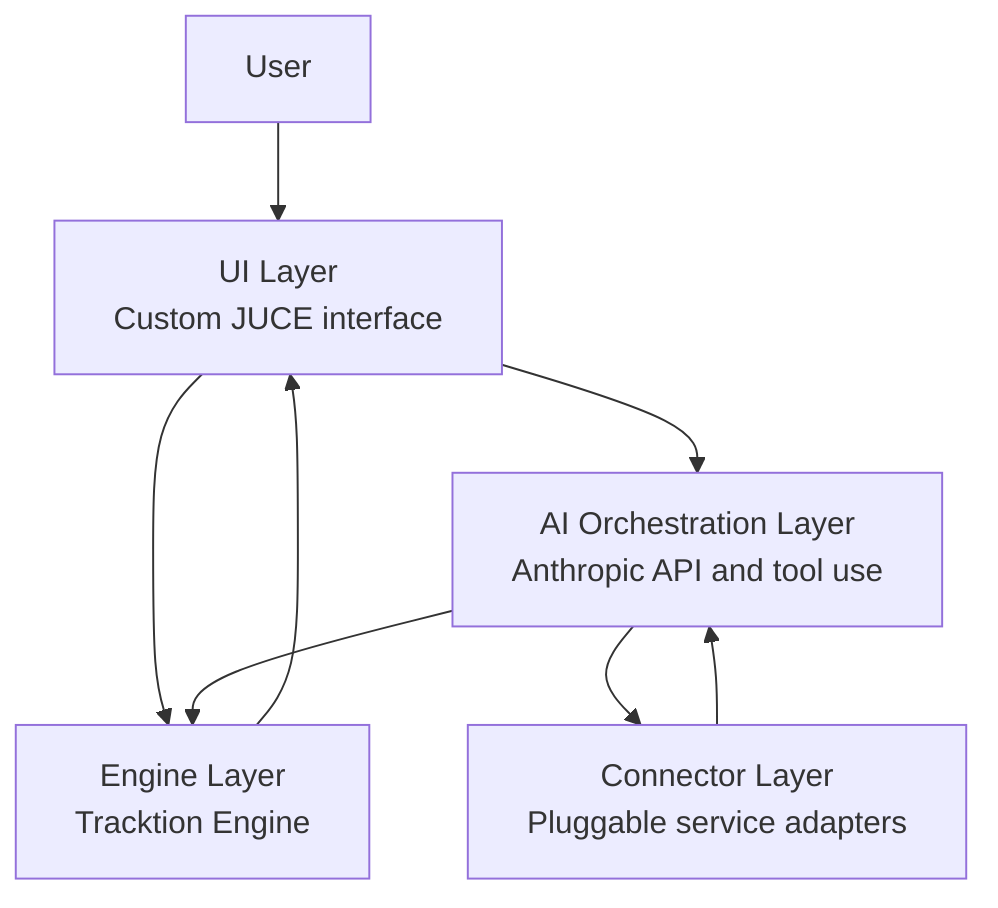

# Architecture

Tracklab is structured as a desktop DAW with a deterministic production core and an AI layer that works through explicit tools and structured metadata.

## System Layers

## Layer Responsibilities

### UI Layer

The UI layer is a custom JUCE-based interface for timeline editing, browsing, mixer workflows, piano roll editing, connector surfaces, and AI chat. It owns interaction design and visual state, but it does not own audio processing rules.

### AI Orchestration Layer

The AI orchestration layer prepares structured context for Anthropic's API, exposes approved tools, evaluates deterministic rules before model calls, and turns model responses into explicit actions that the user can inspect.

### Connector Layer

The connector layer contains pluggable adapters for external services and local resources. Connectors expose typed capabilities such as search, metadata lookup, folder watching, import, and reference collection.

### Engine Layer

The engine layer integrates Tracktion Engine and owns playback, tracks, clips, plugin hosting, routing, automation, project state, and import operations.

## Data Flow Examples

### User Browses Splice And AI Suggests

1. The user opens the Splice connector browser.
2. The Splice connector returns structured metadata for search results, including name, tags, BPM, key, license state, and preview availability.
3. The deterministic layer checks BPM and key compatibility against the current project.
4. The AI layer receives only the filtered metadata and project summary.
5. The AI suggests a small set of candidates with plain-language reasoning.

### User Downloads Sample, Auto Import On Timeline

1. The user selects a sample from a connector result.
2. The connector downloads or resolves the asset through its service-specific flow.
3. The connector emits a local asset record with file path, metadata, source, and license notes where available.
4. The engine imports the asset into the current project.
5. The UI places the clip on the selected track or asks the user for a destination when needed.

### User Asks AI To Find A Kick That Fits

1. The user asks for a kick that fits the current track.
2. The AI layer receives the project state, including tempo, key if known, genre tags if present, and current arrangement summary.
3. The deterministic layer builds a compatibility filter for BPM and key.
4. The AI chooses which connector tools to search, such as Splice and Local Library.
5. Connector results return as structured metadata.
6. The AI ranks candidates based on metadata, tags, and user intent, then explains the tradeoffs.

## Deterministic First

Tracklab uses deterministic rules before the LLM whenever the decision can be made with stable music logic.

- Camelot wheel compatibility runs before model ranking.
- BPM compatibility checks run before model ranking.
- Connector capability checks run before tool calls.
- The LLM handles fuzzy semantic decisions, such as mood, texture, and intent.

There is no black-box audio analysis in v1. The system should be fast, explainable, and debuggable.

## Structured Metadata Only

The AI never operates on audio waveforms in v1. It operates on structured metadata only.

This is deliberate. Metadata-driven AI keeps the system faster, easier to audit, less expensive to run, and more predictable for production workflows.
